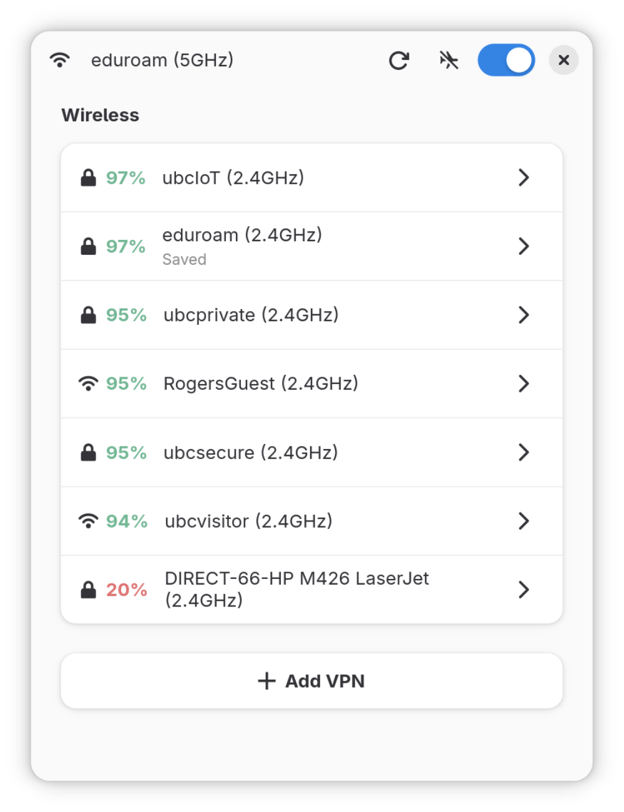
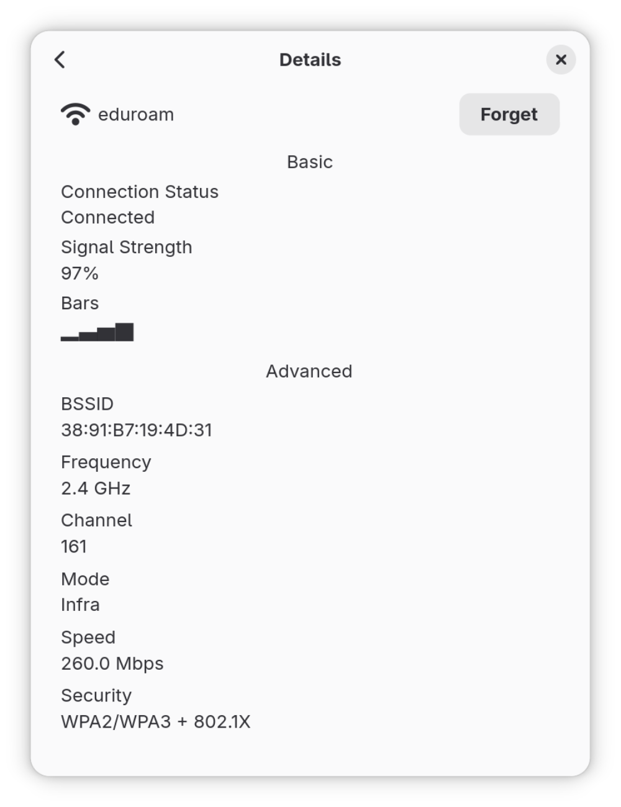

# <p align="center"> nmrs-gui (forked) 🦀

A GTK4 GUI for managing NetworkManager connections on Linux. Built with Rust and libadwaita, unlike upstream

[](https://github.com/networkmanager-rs/nmrs-gui/actions/workflows/ci.yml)
[](https://crates.io/crates/nmrs-gui)

<p align="center">
  
  
</p>

## Features

- Full VPN support for OpenVPN and WireGuard
- Connect to, disconnect from, and forget Wi-Fi networks
- Full Ethernet device support
- WPA-Enterprise (EAP) connections with certificate path support
- Custom CSS theming via `~/.config/nmrs/style.css`

---

- GNOME HIG conforming UI that uses libadwaita components where possible
    - and as such, it's pretty!
- Accessible, screen reader friendly UI using dedicated widgets rather than hacked labels

## Installation

### From source

```bash
# Install GTK4 + libadwaita first (see CONTRIBUTING.md for full dep list)
cargo install --path .
```

### Nix

#### From source

`nix run`

#### Add to your system flake

```nix
# In flake.nix

inputs = {
  nmrs = {
    url = "github:networkmanager-rs/nmrs-gui";
    inputs.nixpkgs.follows = "nixpkgs";
  };
}

# In your packages list

packages = [
  inputs.nmrs.packages.${pkgs.stdenv.hostPlatform.system}.default
];
```

## Usage

```bash
nmrs-gui [OPTIONS]

Options:
  -V, --version    Print version and build hash
  -h, --help       Print help
```

## Theming

Place a `style.css` in `~/.config/nmrs/` to apply custom styles on top of any
pre-defined theme. Your overrides are always loaded last, so they take
precedence.

```css
/* ~/.config/nmrs/style.css */
window {
  background-color: #1e1e2e;
}
```

## License

MIT — see [LICENSE-MIT](LICENSE-MIT).
